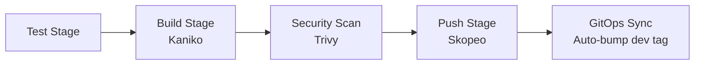

# TrailHead Supply Co. — Microservices (`app-services`)

[](https://gitlab.com/trailhead-supply-co/app-services/-/commits/main)


Core microservices repository for the **TrailHead Supply Co.** e-commerce platform. 

This repository manages **build and test automation** for four microservices: it runs unit & integration tests, builds un-pushed container images using rootless Kaniko, scans local image tarballs for vulnerabilities using Trivy, pushes verified images to Azure Container Registry (ACR) via Skopeo, and automatically updates image tags in the GitOps deployment repository ([`env-config-gitops`](../env-config-gitops)).

---

## Owner & Maintainer Information

* **Owner**: Trailhead Supply Co. Microservices & Engineering Team
* **Maintainers**: Application Engineering ([@mkbntech](https://gitlab.com/mkbntech))
* **Contact & Support**: `dev-team@trailheadsupply.co`
* **Repository**: [`trailhead-supply-co/app-services`](https://gitlab.com/trailhead-supply-co/app-services)

---

## Microservices Architecture

| Service | Directory | Tech Stack | Port | Database / Persistence |
| :--- | :--- | :--- | :--- | :--- |
| **UI (Storefront)** | `services/ui-service` | Node.js 20 + Express + EJS | `3000` | Local Storage (theme state) |
| **Product Catalogue** | `services/catalogue-service` | Python 3.12 + FastAPI | `8001` | In-memory JSON dataset |
| **Recommendation Engine** | `services/recommendation-service` | Go 1.22 | `8002` | Stateless algorithm |
| **Voting & Reviews** | `services/review-service` | Java 21 + Spring Boot + JPA | `8003` | PostgreSQL (`reviews-db`) / H2 fallback |

---

## Repository Layout

```text
app-services/
├── services/
│   ├── ui-service/             # Storefront UI (Node.js/Express, responsive theme toggle)
│   ├── catalogue-service/      # Product Catalogue API (FastAPI)
│   ├── recommendation-service/ # Product Recommendation Engine (Go)
│   └── review-service/         # Reviews & Ratings Service (Spring Boot + PostgreSQL)
├── monitoring/                 # Monitoring configurations & metrics scrapers
├── docker-compose.yml          # Local multi-container development environment
└── .gitlab-ci.yml              # Build, scan, push & GitOps auto-trigger pipeline
```

---

## Local Development

Run all microservices locally alongside a real PostgreSQL instance:

```bash
docker compose up --build
```

Access the application in your browser:
* **Storefront UI**: [http://localhost:3000](http://localhost:3000)
* **Catalogue API Docs**: [http://localhost:8001/docs](http://localhost:8001/docs)
* **Recommendation Health**: [http://localhost:8002/health](http://localhost:8002/health)
* **Review Service API**: [http://localhost:8003/api/reviews](http://localhost:8003/api/reviews)

---

## Automated CI/CD Pipeline

Continuous integration and delivery is defined in [`.gitlab-ci.yml`](file:///.gitlab-ci.yml):



1. **Test Stage**: Runs source-level unit and syntax checks (`node --check`, `py_compile`, `go vet`, `mvn test`).
2. **Build Stage**: Uses `gcr.io/kaniko-project/executor` to build container images without docker daemon access, emitting local `.tar` artifacts (`--no-push`).
3. **Security Scan Stage**: Scans container image `.tar` files using `aquasec/trivy` for `HIGH` and `CRITICAL` vulnerabilities.
4. **Push Stage**: Uses `skopeo` to push verified images to Azure Container Registry (ACR).
5. **GitOps Sync Stage**: Automatically updates `SEMVER_TAG` in `environments/dev/apps/values.yaml` in the [`env-config-gitops`](../env-config-gitops) repository.

---

## Security & Best Practices

* **Rootless & Secure Image Builds**: Kaniko builds container images without requiring a privileged Docker daemon.
* **Vulnerability Gating**: Images are scanned locally with Trivy prior to being uploaded to the container registry.
* **Separation of Concerns**: This repository handles container compilation and image verification; deployment manifests and cluster state are managed exclusively in `env-config-gitops`.

---

## License

This repository is licensed under the [MIT License](LICENSE).